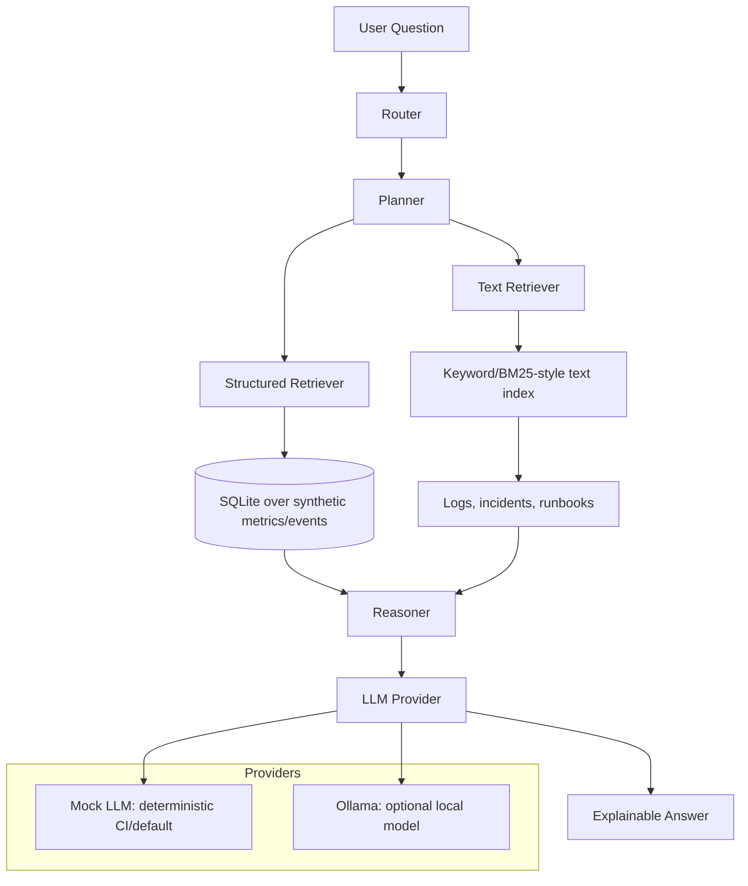

# AI Operations Analyst

AI Operations Analyst is a recruiter-facing AI Engineering portfolio project that investigates synthetic SaaS incidents across metrics, events, logs, incidents, and runbooks. It turns a natural-language operations question into a routed investigation plan, retrieves structured and unstructured evidence, reasons over baseline deltas, and returns an explainable answer with recommended next actions.

This project uses synthetic data only and does not contain proprietary data or internal systems from any employer.

## Problem Statement

Operations teams often need to answer questions such as:

- "Why did checkout latency spike yesterday?"
- "Was this incident caused by a deploy, dependency, or capacity issue?"
- "What evidence supports the likely root cause?"
- "What should we do next?"

This project demonstrates how an AI assistant can support that workflow without relying on private systems or external APIs.

## Architecture



## Features

- Natural-language incident investigation.
- Router and planner agents for intent, service, metric, region, and time-window extraction.
- Structured retrieval over synthetic metrics, events, and anomaly labels.
- Text retrieval over synthetic logs, incident summaries, and runbooks.
- Multi-step reasoning with baseline comparisons and evidence attribution.
- Deterministic `LLM_PROVIDER=mock` mode for CI and demos.
- Optional `LLM_PROVIDER=ollama` mode for local open-model demos.
- FastAPI backend and CLI demo.
- Evaluation framework with threshold validation.
- Tests, Ruff formatting/linting, pre-commit, Docker, and GitHub Actions CI.

## Tech Stack

- Python 3.11+
- FastAPI
- SQLite
- Deterministic synthetic data generator
- Custom lightweight text retrieval
- Mock LLM provider by default
- Optional Ollama provider for local open models
- Pytest, Ruff, GitHub Actions, Docker

## Quickstart

```bash
make install
make demo
```

The demo runs a full investigation for:

```text
Why did checkout-api latency and errors spike in eu-central-1 on April 4?
```

Expected answer themes:

- checkout-api was degraded in `eu-central-1`
- latency, error rate, and queue depth increased versus baseline
- a deployment changed cache behavior before the spike
- logs and runbooks corroborate a cache-related issue
- recommended actions include rollback/feature-flag disablement and cache warmup

## Common Commands

```bash
make install   # install package and dev tools
make data      # regenerate deterministic synthetic data
make demo      # run one full investigation
make test      # run pytest
make eval      # run deterministic evaluation and write reports/evaluation_report.md
make ci        # format check, lint, tests, evaluation
make api       # start FastAPI locally on port 8000
```

## API Demo

Start the API:

```bash
make api
```

Ask a question:

```bash
curl -X POST http://localhost:8000/ask \
  -H "Content-Type: application/json" \
  -d '{"question":"What caused search-api latency to increase in us-west-2 on April 6?"}'
```

## Docker

```bash
docker compose up
```

Then open:

```text
http://localhost:8000/docs
```

The container defaults to `LLM_PROVIDER=mock`, so it does not need API keys, GPUs, managed cloud platforms, or external services.

## LLM Provider Modes

Default deterministic mode:

```bash
LLM_PROVIDER=mock make demo
```

Optional local Ollama mode:

```bash
ollama pull llama3.1:8b
LLM_PROVIDER=ollama OLLAMA_MODEL=llama3.1:8b make demo
```

Ollama is optional. CI always uses `mock`.

## Example Queries

- Why did checkout-api latency and errors spike in eu-central-1 on April 4?
- Investigate the billing-worker retry queue anomaly in us-east-1 on April 5.
- What caused search-api latency to increase in us-west-2 on April 6?
- Give me a performance summary for checkout-api on April 4.
- How should we mitigate checkout-api cache latency?

## Evaluation

The evaluation suite runs representative questions against the deterministic mock pipeline and scores:

- intent routing
- confidence threshold
- required evidence terms in the generated answer

CI writes the evaluation report to `/tmp/ai_ops_evaluation_report.md` and validates thresholds. It does not commit generated reports. A sample report is included in `reports/evaluation_report.md`.

## CI/CD

`.github/workflows/ci.yml` runs on `push` and `pull_request`:

1. Install dependencies.
2. Run `ruff format --check`.
3. Run `ruff check`.
4. Run `pytest`.
5. Run evaluation in `LLM_PROVIDER=mock` mode.

The workflow requires no API keys, no GPU, no managed cloud platform, and no external services.

## What This Demonstrates

- AI system design beyond a thin LLM wrapper.
- Retrieval over mixed structured and unstructured data.
- Agentic routing/planning with deterministic testability.
- Explainable root-cause analysis with evidence and confidence.
- CI-safe model abstraction.
- Production-minded project structure, docs, tests, Docker, and evaluation.

## Project Layout

```text
ai-decision-support-system/
  README.md
  LICENSE
  .env.example
  pyproject.toml
  Makefile
  Dockerfile
  docker-compose.yml
  src/
    app/
    agents/
    retrieval/
    reasoning/
    evaluation/
    data/
    utils/
    llm/
  data/
    synthetic/
  tests/
  docs/
  reports/
  .github/
    workflows/
      ci.yml
```
