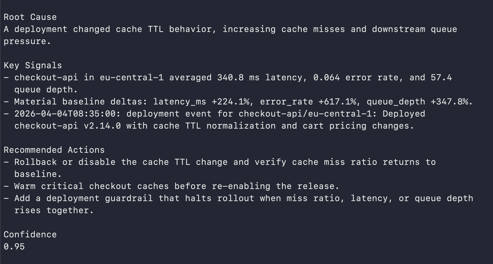
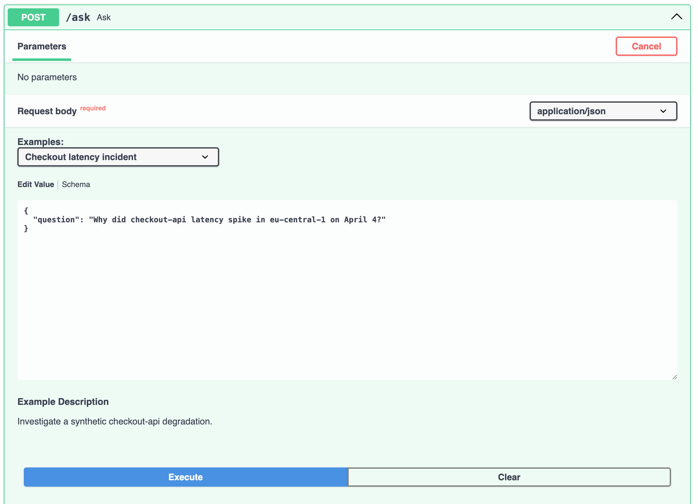
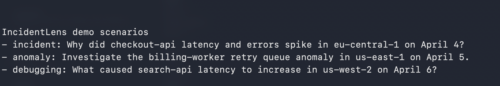
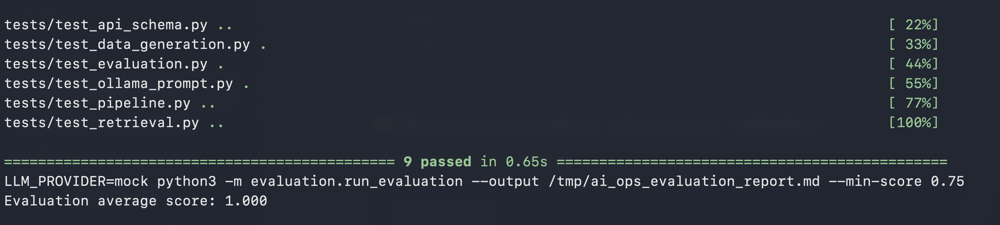
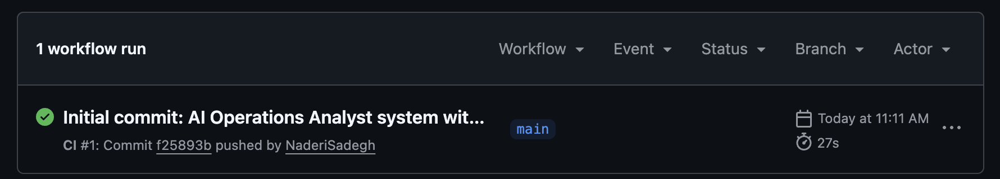

# IncidentLens

AI incident investigation for SaaS operations.

[](https://github.com/sadeghnaderi/ai-decision-support-system/actions/workflows/ci.yml)


IncidentLens answers "what went wrong?" in production-style systems by combining metrics, events, logs, incident records, and runbooks into one concise incident brief.

It is designed to show practical AI engineering: retrieval, reasoning, model abstraction, evaluation, API design, and CI-safe demos. All data is synthetic.

## At A Glance

- Input: a natural-language incident question.
- Output: root cause, key signals, recommended actions, and confidence.
- Interfaces: CLI demo and FastAPI endpoint.
- LLM modes: deterministic mock by default, optional Ollama locally.
- Validation: tests plus evaluation pipeline, scored in CI.

## 2-Minute Demo

```bash
make demo
```

Use a local LLM:

```bash
LLM_PROVIDER=ollama OLLAMA_MODEL=llama3.1:8b make demo
```



## Example Investigation

```text
Root Cause
A deployment changed cache TTL behavior, increasing cache misses and downstream queue pressure.

Key Signals
- checkout-api in eu-central-1 averaged 340.8 ms latency, 0.064 error rate,
  and 57.4 queue depth.
- Material baseline deltas: latency_ms +224.1%, error_rate +617.1%,
  queue_depth +347.8%.
- A deployment event occurred before the alert in the incident window.

Recommended Actions
- Rollback or disable the cache TTL change and verify cache miss ratio returns
  to baseline.
- Warm critical checkout caches before re-enabling the release.
- Add deployment guardrails for miss ratio, latency, and queue depth.

Confidence
0.95
```

## API Example

IncidentLens is exposed as a FastAPI service.

Start Swagger locally:

```bash
make api
```

Open `http://localhost:8000/docs`.

Request:

```json
{
  "question": "Why did checkout-api latency spike in eu-central-1 on April 4?"
}
```

Response shortened:

```json
{
  "result": {
    "reasoning": {
      "likely_cause": "A deployment changed cache TTL behavior, increasing cache misses and downstream queue pressure.",
      "confidence": 0.95,
      "recommendations": [
        "Rollback or disable the cache TTL change",
        "Warm critical checkout caches",
        "Add deployment guardrails"
      ]
    }
  }
}
```



## Demo Scenarios

Run built-in scenarios for incident analysis, anomaly investigation, and system debugging.

```bash
make demo-scenarios
```



## What Makes This Different

- Hybrid evidence: combines structured metrics with unstructured logs, incident records, and runbooks.
- Intent routing: chooses an investigation workflow before retrieval and reasoning.
- Brief output: produces a decision-ready incident brief, not a long generic chat response.
- CI-safe model abstraction: mock mode is deterministic; Ollama is optional for local demos.
- Evaluation-driven: routing, confidence, and evidence terms are checked in CI.

## Architecture

```text
User Query -> Intent Routing -> Retrieval -> Reasoning -> Incident Brief
```

Full architecture notes: [docs/architecture.md](docs/architecture.md)

## Run Locally

```bash
make install
make demo
make demo-scenarios
make api
make ci
```

Docker:

```bash
docker compose up
```

## Validation And CI

All tests pass and the evaluation pipeline achieves a perfect score.

Evaluation score: `1.000`

Sample report: [reports/evaluation_report.md](reports/evaluation_report.md)





## Project Structure

- `src/` - core application: API, agents, retrieval, reasoning, LLM providers
- `tests/` - unit, pipeline, API schema, and prompt tests
- `data/` - synthetic SaaS operations datasets
- `docs/` - demo, architecture, design notes, and checklist
- `reports/` - evaluation outputs

## Engineering Notes

IncidentLens demonstrates AI system design beyond a single model call.

The core engineering work is the system around the model: routing, retrieval, evidence synthesis, deterministic evaluation, and a clean API/CLI surface.

It is intentionally small enough to inspect quickly, but complete enough to show production-style habits: tests, typed schemas, CI, Docker, docs, and reproducible demos.

## More Docs

- [Full demo guide](docs/demo.md)
- [Architecture](docs/architecture.md)
- [Screenshot checklist](docs/demo_checklist.md)
- [Limitations](docs/limitations.md)
